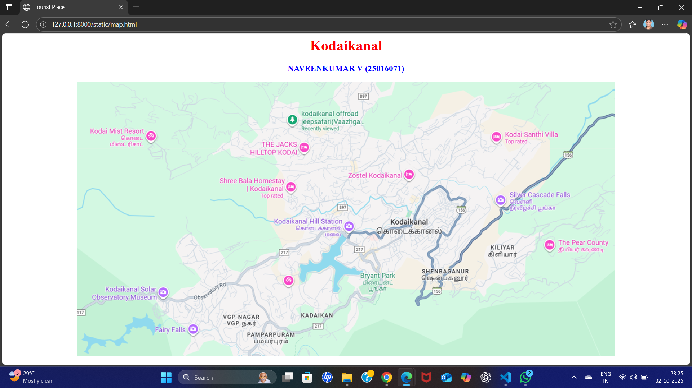
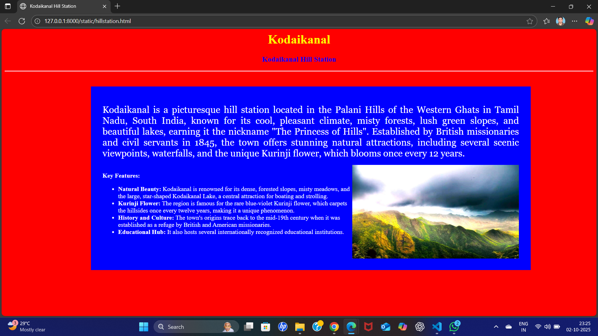
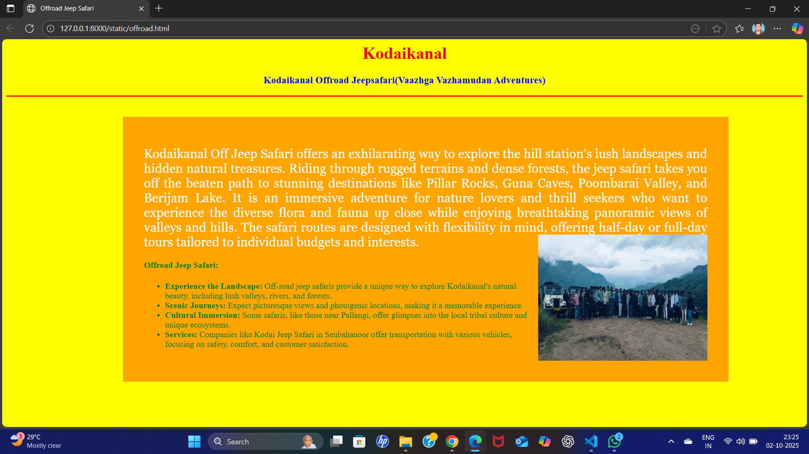
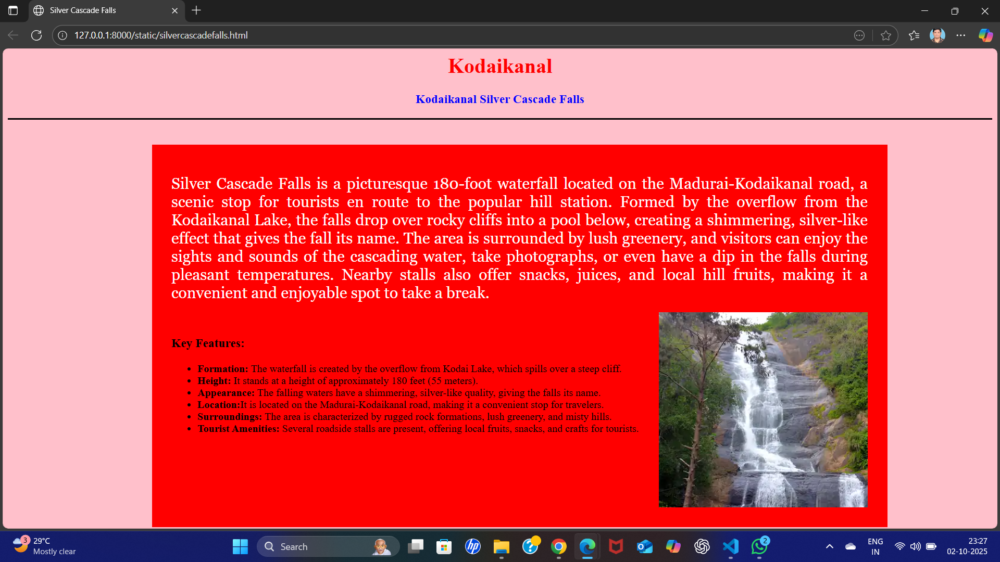
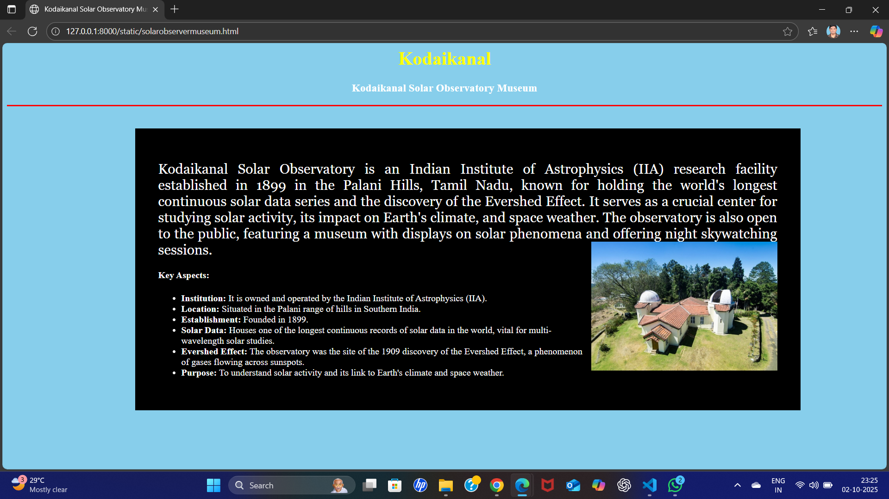
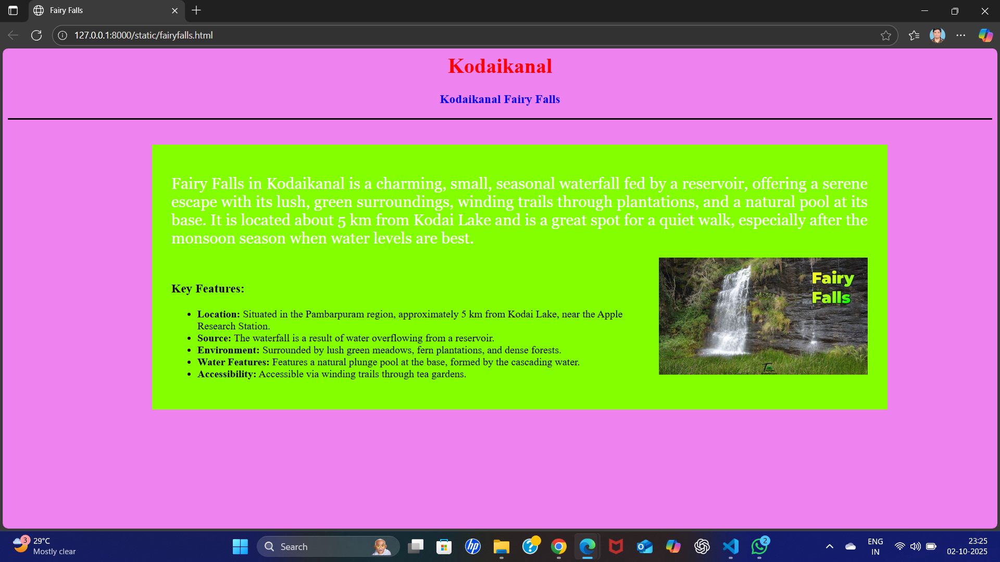

# Ex04 Places Around Me
## Date: 02-10-2025
## Register Number: 25016071
## Name: NAVEENKUMAR V

## AIM
To develop a website to display details about the places around my house.

## DESIGN STEPS

### STEP 1
Create a Django admin interface.

### STEP 2
Download your city map from Google.

### STEP 3
Using ```<map>``` tag name the map.

### STEP 4
Create clickable regions in the image using ```<area>``` tag.

### STEP 5
Write HTML programs for all the regions identified.

### STEP 6
Execute the programs and publish them.

## CODE

map.html
```
<html>
<head>
<title>Tourist Place</title>
</head>
<body>
<h1 align="center">
<font color="red"><b>Kodaikanal</b></font>
</h1>
<h3 align="center">
<font color="blue"><b>NAVEENKUMAR V (25016071)</b></font>
</h3>
<center>
<!-- Image Map Generated by http://www.image-map.net/ -->


<map name="image-map">
    <area target="_blank" alt="Kodaikanal Hill Station" title="Kodaikanal Hill Station" href="hillstation.html" coords="605,326,15" shape="circle">
    <area target="_blank" alt="Kodaikanal Offroad Jeepsafari(Vaazhga vazhamudan adventures)" title="Kodaikanal Offroad Jeepsafari(Vaazhga Vazhamudan Adventures)" href="offroad.html" coords="479,85,13" shape="circle">
    <area target="_blank" alt="Kodaikanal Silver Cascade Falls" title="Kodaikanal Silver Cascade Falls" href="silvercascadefalls.html" coords="941,265,14" shape="circle">
    <area target="_blank" alt="Kodaikanal Solar Observatory Museum" title="Kodaikanal Solar Observatory Museum" href="solarobservermuseum.html" coords="192,469,14" shape="circle">
    <area target="_blank" alt="Kodaikanal Fairy Falls" title="Kodaikanal Fairy Falls" href="fairyfalls.html" coords="259,552,13" shape="circle">
</map>
</center>
</body>
</html>
```
hillstation.html
```
<html>
<head><title>Kodaikanal Hill Station</title>
<style type="text/css">
    .img_deg
    {
        float: right;
        width: 40%;
    }
    .pos_cen
    {
        position: absolute;
        width: 70%;
        left: 15%;
        top: 20%;
        background-color: blue;
        padding: 30px;
    }
</style>
</head>
<body bgcolor="red">
<h1 align="center">
<font color="yellow"><b>Kodaikanal</b></font>
</h1>
<h3 align="center">
<font color="blue"><b>Kodaikanal Hill Station</b></font>
</h3>
<hr size="3" color="pink">
<div class="pos_cen">
<p align="justify">
<font face="Georgia" color="white" size="5">
Kodaikanal is a picturesque hill station located in the Palani Hills of the Western Ghats in Tamil Nadu, South India, known for its cool, pleasant climate, misty forests, lush green slopes, and beautiful lakes, earning it the nickname "The Princess of Hills". Established by British missionaries and civil servants in 1845, the town offers stunning natural attractions, including several scenic viewpoints, waterfalls, and the unique Kurinji flower, which blooms once every 12 years.
</p>   
</font>
<font color="white">
</p>

<p style="color: white">
<br><b>Key Features:</b>
<ul><li><b>Natural Beauty:</b> Kodaikanal is renowned for its dense, forested slopes, misty meadows, and the large, star-shaped Kodaikanal Lake, a central attraction for boating and strolling.</li>
<li><b>Kurinji Flower:</b> The region is famous for the rare blue-violet Kurinji flower, which carpets the hillsides once every twelve years, making it a unique phenomenon.</li>
<li><b>History and Culture:</b> The town's origins trace back to the mid-19th century when it was established as a refuge by British and American missionaries.</li>
<li><b>Educational Hub:</b> It also hosts several internationally recognized educational institutions.</li></ul>
</font>
</p>
</div>
</body>
</html>
```
offroad.html
```
<html>
<head><title>Offroad Jeep Safari</title>
<style type="text/css">
    .img_deg
    {
        float: right;
        width: 30%;
    }
    .pos_cen
    {
        position: absolute;
        width: 70%;
        left: 15%;
        top: 20%;
        background-color: orange;
        padding: 40px;
    }
</style>
</head>
<body bgcolor="yellow">
<h1 align="center"><font color="red"><b>Kodaikanal</b></font></h1>
<h3 align="center">
<font color="blue"><b>Kodaikanal Offroad Jeepsafari(Vaazhga Vazhamudan Adventures)</b></font>
</h3>
<hr size="3" color="red">
<div class="pos_cen">
    <p align="justify">
<font face="Georgia" color="white" size="5">
    Kodaikanal Off Jeep Safari offers an exhilarating way to explore the hill station's lush landscapes and hidden natural treasures. Riding through rugged terrains and dense forests, the jeep safari takes you off the beaten path to stunning destinations like Pillar Rocks, Guna Caves, Poombarai Valley, and Berijam Lake. It is an immersive adventure for nature lovers and thrill seekers who want to experience the diverse flora and fauna up close while enjoying breathtaking panoramic views of valleys and hills. The safari routes are designed with flexibility in mind, offering half-day or full-day tours tailored to individual budgets and interests.
</font>
<font color="green">

<p><h4>Offroad Jeep Safari: </h4>
<ul><li><b>Experience the Landscape:</b> Off-road jeep safaris provide a unique way to explore Kodaikanal's natural beauty, including lush valleys, rivers, and forests.</li>
<li><b>Scenic Journeys:</b> Expect picturesque views and photogenic locations, making it a memorable experience.</li>
<li><b>Cultural Immersion:</b> Some safaris, like those near Pallangi, offer glimpses into the local tribal culture and unique ecosystems.</li>
<li><b>Services:</b> Companies like Kodai Jeep Safari in Senbahanoor offer transportation with various vehicles, focusing on safety, comfort, and customer satisfaction.</li></ul>
</p>
</font>
</div>
</body>
</html>
```
silvercascadefalls.html
```
<html>
<head><title>Silver Cascade Falls</title>
<style type="text/css">
    .img_deg
    {
        float: right;
        width: 30%;
    }
    .pos_cen
    {
        position: absolute;
        width: 70%;
        left: 15%;
        top: 20%;
        background-color: rgb(255, 0, 0);
        padding: 30px;
    }
</style>
</head>
<body bgcolor="pink">
<h1 align="center"><font color="red"><b>Kodaikanal</b></font></h1>
<h3 align="center">
<font color="blue"><b>Kodaikanal Silver Cascade Falls</b></font>
</h3>
<hr size="3" color="black">
<div class="pos_cen">
<p align="justify">
<font face="Georgia" color="white" size="5">
Silver Cascade Falls is a picturesque 180-foot waterfall located on the Madurai-Kodaikanal road, a scenic stop for tourists en route to the popular hill station. Formed by the overflow from the Kodaikanal Lake, the falls drop over rocky cliffs into a pool below, creating a shimmering, silver-like effect that gives the fall its name. The area is surrounded by lush greenery, and visitors can enjoy the sights and sounds of the cascading water, take photographs, or even have a dip in the falls during pleasant temperatures. Nearby stalls also offer snacks, juices, and local hill fruits, making it a convenient and enjoyable spot to take a break. 
</font>
</p>

<p>
<br><h3>Key Features:</h3>
<ul><li><b>Formation:</b> The waterfall is created by the overflow from Kodai Lake, which spills over a steep cliff.</li>
<li><b>Height:</b> It stands at a height of approximately 180 feet (55 meters).</li>
<li><b>Appearance:</b> The falling waters have a shimmering, silver-like quality, giving the falls its name.</li> 
<li><b>Location:</b>It is located on the Madurai-Kodaikanal road, making it a convenient stop for travelers.</li> 
<li><b>Surroundings:</b> The area is characterized by rugged rock formations, lush greenery, and misty hills.</li> 
<li><b>Tourist Amenities:</b> Several roadside stalls are present, offering local fruits, snacks, and crafts for tourists.</li></ul>
</p>
</div>
</body>
</html>
```
solarobservermuseum.html
```
<html>
<head><title>Kodaikanal Solar Observatory Museum</title>
    <style type="text/css">
    .img_deg
    {
        float: right;
        width: 30%;
    }
    .pos_cen
    {
        position: absolute;
        width: 70%;
        left: 15%;
        top: 20%;
        background-color: black;
        padding: 40px;
    }
</style>
</head>
<body bgcolor="skyblue">
<h1 align="center"><font color="yellow"><b>Kodaikanal</b></font></h1>
<h3 align="center"><font color="white"><b>Kodaikanal Solar Observatory Museum</b></font></h3>
<hr size="3" color="red">
<div class="pos_cen">
<p align="justify">
<font face="Georgia" color="white" size="5">
    Kodaikanal Solar Observatory is an Indian Institute of Astrophysics (IIA) research facility established in 1899 in the Palani Hills, Tamil Nadu, known for holding the world's longest continuous solar data series and the discovery of the Evershed Effect. It serves as a crucial center for studying solar activity, its impact on Earth's climate, and space weather. The observatory is also open to the public, featuring a museum with displays on solar phenomena and offering night skywatching sessions.
</font>
<font color="white">

<p>
<h4>Key Aspects: </h4>
<ul><li><b>Institution:</b> It is owned and operated by the Indian Institute of Astrophysics (IIA).</li>
<li><b>Location:</b> Situated in the Palani range of hills in Southern India.</li>
<li><b>Establishment:</b> Founded in 1899.</li>
<li><b>Solar Data:</b> Houses one of the longest continuous records of solar data in the world, vital for multi-wavelength solar studies.</li> 
<li><b>Evershed Effect:</b> The observatory was the site of the 1909 discovery of the Evershed Effect, a phenomenon of gases flowing across sunspots.</li> 
<li><b>Purpose:</b> To understand solar activity and its link to Earth's climate and space weather.</li></ul> 
</p>
</font>
</div>  
</body>
</html>
```
fairyfalls.html
```
<html>
<head><title>Fairy Falls</title>
<style type="text/css">
    .img_deg
    {
        float: right;
        width: 30%;
    }
    .pos_cen
    {
        position: absolute;
        width: 70%;
        left: 15%;
        top: 20%;
        background-color: rgb(132, 255, 0);
        padding: 30px;
    }
</style>
</head>
<body bgcolor="violet">
<h1 align="center"><font color="red"><b>Kodaikanal</b></font></h1>
<h3 align="center">
<font color="blue"><b>Kodaikanal Fairy Falls</b></font>
</h3>
<hr size="3" color="black">
<div class="pos_cen">
<p align="justify">
<font face="Georgia" color="white" size="5">
Fairy Falls in Kodaikanal is a charming, small, seasonal waterfall fed by a reservoir, offering a serene escape with its lush, green surroundings, winding trails through plantations, and a natural pool at its base. It is located about 5 km from Kodai Lake and is a great spot for a quiet walk, especially after the monsoon season when water levels are best.
</font>
</p>

<p>
<br><h3>Key Features:</h3>
<ul><li><b>Location:</b> Situated in the Pambarpuram region, approximately 5 km from Kodai Lake, near the Apple Research Station.</li>
<li><b>Source:</b> The waterfall is a result of water overflowing from a reservoir.</li> 
<li><b>Environment:</b> Surrounded by lush green meadows, fern plantations, and dense forests.</li>
<li><b>Water Features:</b> Features a natural plunge pool at the base, formed by the cascading water.</li> 
<li><b>Accessibility:</b> Accessible via winding trails through tea gardens.</li></ul>
</p>
</div>
</body>
</html>
```
## OUTPUT







## RESULT
The program for implementing image maps using HTML is executed successfully.
